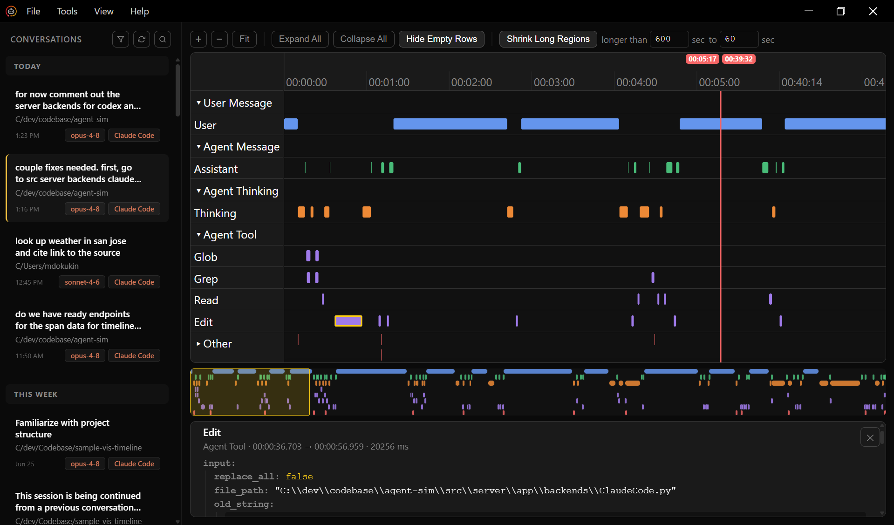

# AgentSim — visualize your agentic-coding sessions on a timeline

AgentSim reads the transcripts your agentic coding tools leave behind and lays
each session out on a GarageBand-style timeline of messages, thinking, and tool
calls. See how a session actually unfolded — what the agent read, when it
thought, which tools it fired, and how long each step took.

It is **read-only**: it displays and plays back your sessions, it never modifies
them.

## What you can do

- **See every session on one timeline.** Each session becomes a track; each
  message, thinking block, and tool call becomes a span you can scan at a
  glance.
- **Play a session back.** Step through a session in order and watch it replay
  the way it originally ran.
- **Zoom and pan.** Cursor-anchored wheel zoom and drag-to-scroll let you go
  from a whole day of work down to a single tool call.
- **Filter to what matters.** Narrow the view by tool, model, project, or time
  range, and jump straight to live/in-progress sessions.
- **Drill into a session.** Open any session to see its full trace — the
  complete sequence of spans with their timing.
- **Manage your data sources.** Add or remove sources from **File → Manage Data
  Sources** (auto-detected or added by path). Your choices persist between runs.

## Data sources

AgentSim reads sessions straight from where your tools already store them —
nothing to export or configure.

| Source | Reads from | Status |
| --- | --- | --- |
| Claude Code | `~/.claude/projects/<project>/<id>.jsonl` | Supported |

More tools are on the way.

## Getting started

1. Download the latest Windows release from the **Releases** section in the
   sidebar on the right.
2. Run the installer.
3. Open the app and go to **File → Add Data Source**, then pick a
   supported/detected backend.

> **Windows only** for now — other platforms are on the way.
